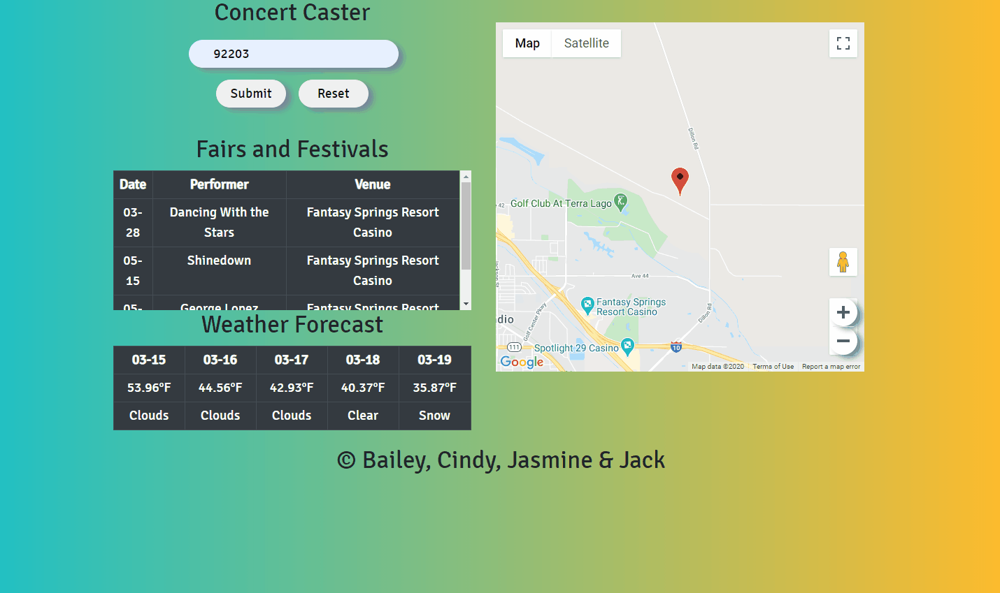

# concert-caster

A weather forecasting app for concert goers who want to plan their trips.

### Technologies used
- AJAX
- APIs
- JavaScript
- jQuery
- HTML5
- CSS3
- Bootstrap4

## Live Demo
Try the application live at http://concert-caster.baileyohill.com/

## Features
- User can allow application to access her location
- User can view a map from google maps.
- User can provide a zip code.
- User can view concerts, weather forecast, and map in her specified zip code.

## Preview

## Development
### Getting Started
1. Clone the repository.
`git clone https://github.com/bailey-hill/concert-caster
cd sgt-react`

2. Start the project. Open index.html in your browser.
